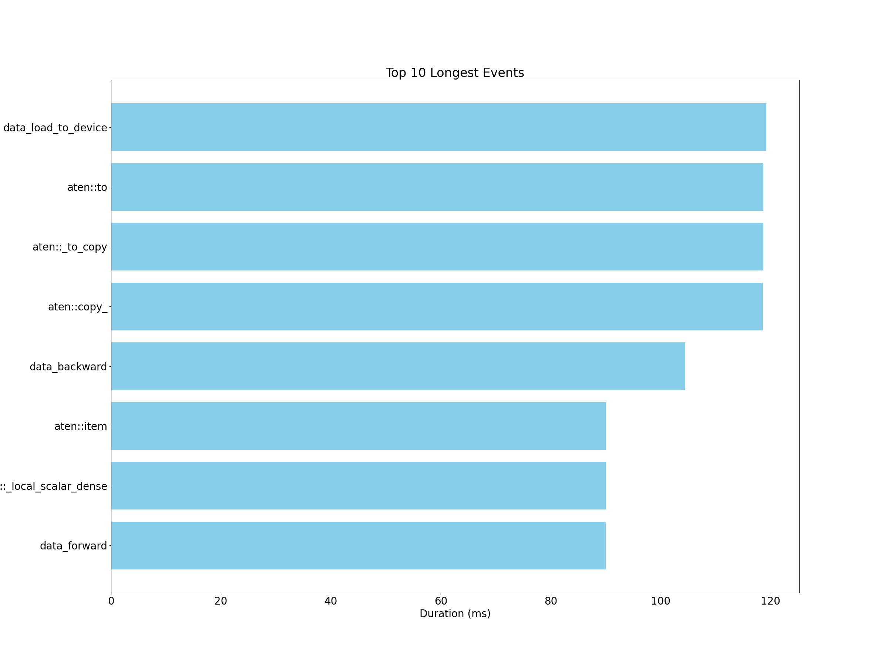
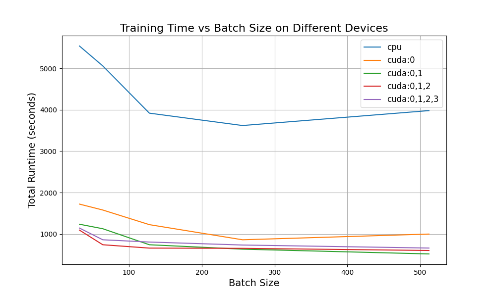
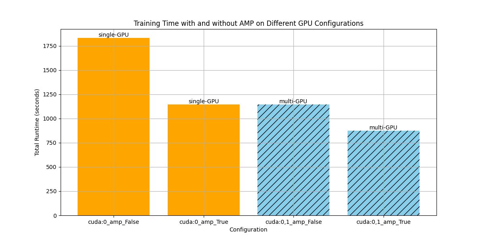
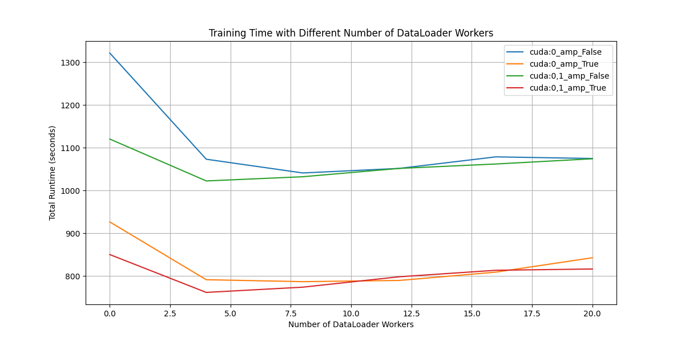
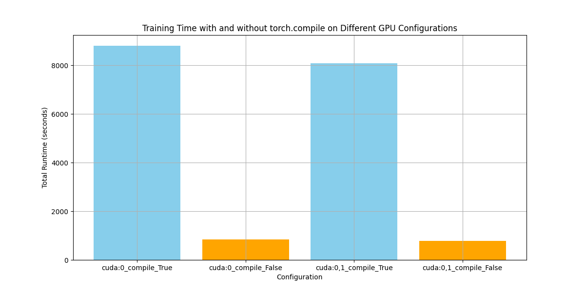

# Performance-Preserving-Optimization-of-Diffusion-Networks

## Project Description
The main goal of the project is to explore and implement various methods to optimize the training of diffusion networks while preserving performance, using PyTorch Profiling tools. We used the CIFAR-10 dataset for our experiments, which was downloaded from Kaggle and converted to a folder set using the `cifar-10` script.

## Repository Structure

Performance-Preserving-Optimization-of-Diffusion-Networks/ 
├── README.md # Project description file 
├── denoising_diffusion_pytorch.py # Diffusion model implementation 
├── denoising_diffusion_pytorch_with_profile.py # Diffusion model implementation with torch profile
├── try_pytorch_profile.py # Script for performance analysis using PyTorch Profiler 
├── try_mulit_gpu.py # Multi-GPU training script 
├── try_amp.py # AMP (Automatic Mixed Precision) training script
├── try_torch_compile.py # Script for training with torch.compile 
├── image_output/ # Folder to store results 
├── trace_output/ # Folder to store Chrome trace files 
|── cifar-10/ # CIFAR-10 dataset

## Data Preparation
Download [cifar-10](https://www.kaggle.com/c/cifar-10/) and decompress train.7z. The direcotry structure is as below:

cifar-10/
|── train
    |──1.png
    |──2.png
    |──....

## Execute 

### Performance Analysis
To perform performance analysis using PyTorch Profiler:
```
python [try_pytorch_profile.py]
```
Multi-GPU Training
To train on single GPU and multiple GPUs:
```
python try_mulit_gpu.py
```

AMP Training
To train with and without AMP:
```
python try_amp.py
```

Training with torch.compile
To train with and without torch.compile:
```
python try_torch_compile.py
```

## Results
### Performance Analysis Results
This figure shows the eight most time consuming operations obtained from the analysis of the pytorch profile.



### Multi-GPU Training Results
The comparison of training times on single GPU and multiple GPUs is shown in the figure below:



### AMP vs no-AMP Training Results
Based on the previous GPU experi-mental results, we chose a batch size of 128 and conducted experiments using one or two GPUs. We measured the time consumption with enabling and disabling Automatic Mixed Precision (AMP),


### Training on different dataloader workers
We are studying how the training time varies with the number of dataloader workers starting from zero and increment the number of workers by 4.



### Torch.compile vs non-Torch.compile
The impact of torch.compile on the performance improvement of model training under the conditions of batch size 128, one or two GPUs, with AMP enabled, and
num workers set to 4 is tested.



## Observations and Summary

1) Framework Effectiveness: Our framework successfully identified the optimal configurations for training diffusion models. For instance, AMP proved to significantly accelerate training, and setting the num workers to 4 balanced data loading efficiency with minimal overhead. 

2) Scalability and Limitations: While multi-GPU setups provided significant time reductions for larger batch sizes, their scaling efficiency diminished beyond three GPUs. Additionally, torch.compile, despite its general potential, was found unsuitable for this specific diffusion model due to excessive overhead.

3) General Applicability: Beyond diffusion models, this framework can be applied to other deep learning or machine learning domains to systematically analyze and optimize training processes. It provides a clear and reusable methodology for benchmarking and improving training efficiency across a wide range of tasks.
